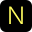

# NEST — Creative Studio Landing Page

<div align="center">
  
  <h3>Obsessive Digital Craft & Engineering for High-Growth Founders</h3>
  <p>A high-performance, neo-brutalist creative studio landing page with bespoke interactive mechanics, tactile physics, and Awwwards-grade kinetic smooth scrolling.</p>
</div>

<p align="center">
  
  
  
  
</p>

---

## ✨ Highlights & Interactive Mechanics

### 1. 🌊 Awwwards-Grade Kinetic Smooth Scrolling
- Powered by an integrated **Lenis** smooth-scroll engine.
- Replaces standard discrete mouse-wheel jumps with a fluid, exponential deceleration glide curve (`1.25s` duration).
- Sub-pixel scroll interpolation synced directly to `requestAnimationFrame` at 60/120fps.

### 2. 🔄 Scroll-Driven 3-Panel Circular Interchange ("Having Second Thoughts?")
- A circular 3-panel interactive showcase strictly driven by user scroll position.
- Smoothly rotates through bespoke design showcases (Brand Architecture, System Architecture, Mobile Platforms) with matching synchronized typography and badges.

### 3. ✍️ Scroll-Triggered Hand-Drawn SVG Underlines
- Custom SVG stroke dashoffset animation that sketches from left to right as you scroll into view:
  - **"Don't worry"** red marker underline.
  - **"Who are WE"** red emphasis scribble.
- Uses `IntersectionObserver` to dynamically measure path length and replay cleanly whenever re-entering the viewport.

### 4. 📖 Word-by-Word Reading Highlight
- Real-time scroll progress tracker across the "Who are we" studio manifesto.
- Words illuminate from muted gray (`#838383`) to white as you read down the section.

### 5. ⚡ Symmetrical Infinite Client Logo Marquee
- Continuous vector marquee banner with inner drop shadow and acid-yellow fill.
- Mathematically balanced with exact, uniform $48.13\text{px}$ bullet-to-text spacing across all 6 repetitions and seamless zero-jerk wrap-around.

### 6. ⏱️ Studio Colophon & Live London Time Clock
- Bespoke minimalist studio colophon nestled above the footer.
- Features live studio availability status and a real-time ticking GMT / London studio clock.

### 7. 🎯 Tactile Micro-Interactions & Hover Dynamics
- **360° Hover Inertia**: Service card icons rotate a full 360° on hover with silky cubic-bezier deceleration.
- **Accordion FAQ**: Spring-expanded accordion questions with zero layout shift.
- **Stationary Button Physics**: Instant tactile feedback without disorienting layout lift.
- **Hidden Scrollbars**: Complete elimination of browser scrollbars across Chrome, Safari, Firefox, and Edge while preserving natural mouse/trackpad scrolling.

---

## 🎨 Design System & Color Tokens

| Token | Hex | Role |
| :--- | :--- | :--- |
| **Acid Yellow** | `#FFFC5F` | Primary brand accent, text highlights, selection fill |
| **Charcoal Dark** | `#2F2F2F` | Base canvas, dark panels, navbar |
| **Deep Obsidian** | `#1B1B1B` | Deep contrast background, colophon |
| **Pure White** | `#FFFFFF` | Service cards, highlighted typography |
| **Studio Red** | `#FF3939` | Hand-drawn scribble vectors & underlines |

### Typography
- **Headings & Badges**: `Instrument Sans` / `Instrument Serif`
- **Body & Accents**: `Inter` (weights 300 to 800)

---

## 🛠️ Tech Stack

- **Core**: Semantic HTML5, Vanilla ES6+ JavaScript
- **Styling**: Modern Vanilla CSS (Custom properties, 2D/3D Transforms, WebKit extensions)
- **Kinetic Physics**: [Lenis](https://github.com/darkroomengineering/lenis) (13KB self-contained bundle)
- **Tooling**: Vite (optional dev server) / Pure Static Deployment

---

## 🚀 Getting Started

No build tools or heavy package managers required. The project is completely self-contained and runs in any modern browser.

### Option 1: Direct Static Run
Open `index.html` directly in your browser:
```bash
# macOS
open index.html

# Linux
xdg-open index.html
```

### Option 2: Local Development Server
```bash
# Using Python
python3 -m http.server 3000

# Or using Node / npx
npx serve .
```
Navigate to `http://localhost:3000`.

---

## 📁 Repository Structure

```
Nest landing page/
├── index.html              # Core semantic HTML5 layout & SVG definitions
├── public/
│   ├── styles.css          # Design tokens, responsive scaler & animations
│   ├── script.js           # Scroll logic, interchange engine & observers
│   ├── lenis.min.js        # Self-contained kinetic smooth scroll engine
│   ├── favicon.svg         # Studio yellow 'N' vector favicon
│   ├── team.jpg            # Studio team photograph
│   └── *.png / *.jpg       # Visual design assets & wireframes
├── imports/                # Raw vector exports and component reference
├── src/                    # TypeScript / React reference sources
└── README.md               # Project documentation
```

---

## 📄 License

MIT © [byanam](https://github.com/byanam)
